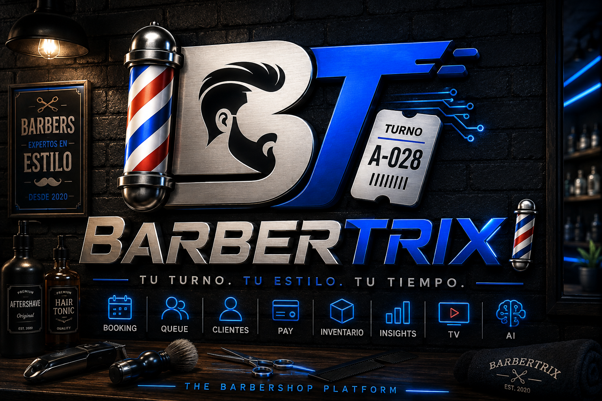

<p align="center">
  
</p>

<p align="center">
  
</p>

<p align="center">
  
  
  
  
  
  
  
  
  
</p>

# BarberTurn 💈

**BarberTurn** es una plataforma SaaS multi-tenant para gestionar la operación diaria de barberías: turnos por llegada, citas, barberos, servicios, clientes, caja, reportes, BarberTurn TV y suscripciones comerciales.

> **Tu turno. Tu estilo. Tu tiempo.**

La premisa del producto es simple: la tecnología debe adaptarse a la forma de trabajar de la barbería, no al revés.

## 🚀 Estado del proyecto

BarberTurn se encuentra en **cierre de la web v1 y preparación para una salida comercial controlada**. El núcleo funcional está implementado y `main` se mantiene validado mediante CI, pruebas automatizadas, análisis de seguridad y gates progresivos de cobertura.

El checklist de cierre está documentado en [`docs/web-v1-finalization.md`](docs/web-v1-finalization.md). La aplicación móvil se retomará después de completar este cierre web.

### Operación principal

- 🚶 fila digital por orden de llegada;
- 📅 agenda de citas y operación híbrida;
- ✂️ gestión de barberos y disponibilidad;
- 🧴 catálogo de servicios, duración y precios;
- 🎟️ ciclo completo `Waiting → Called → InService → Completed`;
- ❌ estados alternativos `Cancelled` y `NoShow`;
- 📊 métricas operativas de la cola;
- ⚡ SignalR para actualización en tiempo real;
- 📺 BarberTurn TV;
- 🌐 autoservicio público con tokens opacos.

### Gestión comercial

- 👥 CRM básico de clientes;
- 💵 registro de pagos/caja;
- 📈 reportes de negocio;
- 🧑‍🤝‍🧑 equipo, invitaciones y roles;
- 🏪 sucursales y configuración por barbería;
- 🧾 auditoría de operaciones;
- 💳 planes Starter / Pro / Business;
- 💰 suscripciones SaaS mediante PayPal;
- 🔒 capacidades y límites aplicados también en backend.

### Portales y demo

- 👑 **Owner / Administrator / Receptionist:** panel administrativo según permisos;
- ✂️ **Barber Portal:** jornada, cola asignada, estado y citas propias sin ruido administrativo;
- 👤 **Customer Portal:** autoservicio público sin requerir cuenta;
- 🧪 **Demo comercial limitada:** permite probar el núcleo y mantiene visibles las funciones premium mediante paywalls/CTA sin exponer operaciones sensibles.

Los clientes pueden tomar turnos y reservar citas sin crear una cuenta. Una cuenta de cliente registrada no forma parte todavía del alcance actual.

## 💳 Capacidades por plan

Las capacidades se validan en servidor; ocultar o bloquear una opción en React nunca es el único control.

| Capacidad | Starter | Pro | Business |
|---|:---:|:---:|:---:|
| Cola por llegada | ✅ | ✅ | ✅ |
| Gestión básica de barberos/servicios | ✅ | ✅ | ✅ |
| Citas | ❌ | ✅ | ✅ |
| BarberTurn TV | ❌ | ✅ | ✅ |
| Reportes avanzados | ❌ | ❌ | ✅ |
| Suscripción y límites de uso | ✅ | ✅ | ✅ |

Las reglas comerciales pueden evolucionar antes de la salida pública; el backend es la fuente de verdad para entitlements.

## 🧰 Stack tecnológico

### 🟣 Backend

<p align="left">
  
  
</p>

<p align="left">
  
  
  
  
  
  
</p>

- .NET 10;
- ASP.NET Core Web API;
- Entity Framework Core;
- SQL Server 2022;
- JWT;
- SignalR;
- OpenAPI en Development;
- PayPal REST API.

### 🔵 Frontend

<p align="left">
  
</p>

<p align="left">
  
  
  
  
  
  
  
</p>

- React 19;
- TypeScript;
- Vite 8;
- CSS modularizado por experiencia/feature;
- Font Awesome;
- QRCode;
- SweetAlert2;
- Vitest + React Testing Library;
- Playwright.

### 🗄️ Datos e infraestructura

<p align="left">
  
  
</p>

<p align="left">
  
  
  
  
  
</p>

- Docker + Docker Compose;
- Nginx;
- GitHub Actions;
- CodeQL;
- Gitleaks;
- cobertura backend/frontend con gates progresivos.

## 🏗️ Arquitectura

```text
BarberTurn
├── backend
│   ├── src
│   │   ├── BarberTurn.Domain
│   │   ├── BarberTurn.Application
│   │   ├── BarberTurn.Infrastructure
│   │   └── BarberTurn.Api
│   └── tests
│       ├── BarberTurn.Domain.Tests
│       └── BarberTurn.Api.Tests
├── frontend
│   ├── e2e
│   └── src
│       ├── features
│       ├── portals
│       ├── i18n
│       ├── shared
│       └── ...
├── deploy
│   └── sql
├── docs
├── .github
│   └── workflows
├── BarberTurn.sln
├── docker-compose.yml
└── docker-compose.production.yml
```

### Responsabilidades

- **Domain:** entidades, estados e invariantes de negocio.
- **Application:** contratos, DTOs y casos de uso sin depender de EF Core.
- **Infrastructure:** persistencia, SQL Server, servicios externos y adaptadores.
- **API:** transporte HTTP, autenticación/autorización, middleware y composición.
- **Frontend:** portales y features desacoplados por responsabilidad.

La dirección buscada es:

```text
API
 ↓
Application
 ↓
Infrastructure
 ↓
SQL Server / proveedores externos
```

Los endpoints no deben convertirse en una segunda capa de persistencia ni consultar el DbContext para lógica de negocio que corresponda a Application/Infrastructure.

## 🔐 Seguridad

Controles relevantes:

- access tokens JWT de vida corta;
- refresh token rotatorio en cookie `HttpOnly` y `SameSite=Lax`, `Secure` bajo HTTPS;
- revocación de sesión y security stamp;
- hashing de contraseñas;
- política de contraseña de 10+ caracteres con mayúscula, minúscula, número y símbolo;
- aislamiento multi-tenant por `BarberShopId`;
- autorización por roles;
- verificación de correo;
- recuperación de contraseña sin enumeración de usuarios;
- rate limiting para autenticación, registro, autoservicio y webhooks;
- separación SignalR por audiencias `internal`, `public` y `tv`;
- encabezados HTTP de seguridad;
- validación de firma de webhooks PayPal;
- secretos exclusivamente por configuración externa;
- CodeQL y Gitleaks en CI.

Los errores API utilizan un contrato estable:

```json
{
  "code": "AUTH_INVALID_CREDENTIALS",
  "message": "...",
  "correlationId": "..."
}
```

El frontend puede localizar el mensaje por `code` y el `correlationId` permite rastrear el incidente sin revelar detalles internos.

Consulta [`SECURITY.md`](SECURITY.md) para el proceso de reporte y los controles vigentes.

## 🔭 Observabilidad

BarberTurn incorpora:

- `X-Correlation-ID` por request;
- logs JSON en Production;
- contexto estructurado de tenant/usuario cuando existe;
- método, path, status code y duración de requests;
- logging específico de eventos de billing/webhooks sin registrar tokens, firmas ni secretos;
- health check de base de datos.

La arquitectura queda preparada para incorporar OpenTelemetry, métricas y tracing cuando exista infraestructura real de observabilidad.

Nunca deben registrarse passwords, JWT, refresh tokens, cookies, secretos SMTP/PayPal ni cuerpos completos de webhooks.

## 🗄️ SQL Server y mínimo privilegio

`docker-compose.production.yml` separa las identidades de base de datos:

```text
sa
└─ bootstrap inicial de la instancia

barberturn_migrator
└─ aplica migraciones

barberturn_app
└─ runtime de la API
```

La API **no se conecta como `sa`**. `barberturn_app` recibe únicamente permisos de lectura/escritura requeridos por la aplicación, mientras `barberturn_migrator` ejecuta el job de migraciones antes del arranque de la API.

Variables adicionales de producción:

```text
BARBERTURN_DB_PASSWORD
BARBERTURN_DB_MIGRATOR_PASSWORD
BARBERTURN_DB_APP_PASSWORD
```

Consulta [`docs/production-operations.md`](docs/production-operations.md) para backups, alertas, secretos, TLS y checklist de lanzamiento.

## 🧪 Testing

### Backend

- pruebas de dominio;
- integración API + SQL Server;
- autenticación, refresh/logout y cookies;
- aislamiento multi-tenant;
- error codes y correlation IDs;
- validación de migraciones;
- gates progresivos sobre lógica crítica.

### Frontend

Vitest + React Testing Library cubren, entre otros:

- autenticación;
- demo;
- roles y redirecciones;
- Barber Portal;
- paywalls/capabilities;
- política de contraseñas;
- errores localizados.

### E2E

BarberTurn mantiene dos niveles de Playwright deliberadamente separados:

1. **E2E de navegador con backend simulado**, para validar de forma determinista los flujos de UX: registro, login, dashboard, ciclo de turnos, demo comercial, Barber Portal, Customer Portal, restricciones por rol, Starter vs funciones premium y billing del Owner.
2. **E2E full-stack real**, que levanta React + ASP.NET Core + SQL Server 2022 y valida registro de Owner, carga del dashboard y posterior login contra datos persistidos realmente en SQL Server.

El job `Full-stack E2E (React + API + SQL Server)` forma parte del CI y es requisito previo para construir las imágenes de producción. Las dos suites publican artifacts de Playwright para diagnóstico cuando una ejecución falla.

## 🌐 Internacionalización

Locales soportados:

| Locale | Idioma |
|---|---|
| `es-419` | Español Latino |
| `en` | English |
| `es-ES` | Español de España |

Las traducciones están modularizadas por locale y dominio (`common`, `auth`, `dashboard`, `billing`, `customer`, etc.). No se fuerzan diferencias artificiales entre `es-419` y `es-ES` cuando una traducción es natural en ambos mercados.

## ♿ Accesibilidad

La interfaz incorpora una base técnica alineada con buenas prácticas de NORTIC B2 / WCAG:

- navegación por teclado;
- foco visible;
- skip link;
- `aria-live`, `aria-describedby`, `aria-busy`, `aria-pressed`;
- gestión de foco al cambiar de vista;
- semántica para lectores de pantalla;
- `prefers-reduced-motion`;
- formularios con errores asociados.

Esto **no constituye certificación formal** sin una auditoría completa.

## 🐳 Desarrollo local

```bash
cp .env.example .env
docker compose up --build
```

Servicios por defecto:

- Frontend: `http://localhost:8081`
- API: `http://localhost:8080/api`
- Health: `http://localhost:8080/health`
- OpenAPI Development: `http://localhost:8080/openapi/v1.json`
- SQL Server: `localhost:1433`

El entorno local puede aplicar migraciones al arrancar. Producción utiliza un job separado.

## 🚀 Producción

```bash
cp .env.production.example .env.production
# Configurar secretos reales
docker compose --env-file .env.production -f docker-compose.production.yml up -d --build
```

Orden de arranque:

```text
SQL Server
→ bootstrap de identidades
→ migraciones
→ API
→ frontend
```

Requisitos externos antes de un lanzamiento comercial:

- DNS y TLS;
- gestor de secretos;
- SMTP transaccional;
- Turnstile;
- PayPal Live + webhook;
- backups y restauración probada;
- métricas/alertas centralizadas;
- revisión legal;
- auditoría formal de accesibilidad según alcance.

## 🗺️ Roadmap

### ✅ Fases 1–6

Fundación técnica, núcleo de turnos, tiempo real, citas, gestión comercial y SaaS completados.

### 🟢 Hardening web v1

- ✅ refresh token HttpOnly y rotación segura;
- ✅ aislamiento multi-tenant reforzado;
- ✅ SignalR por audiencias;
- ✅ demo comercial limitada y portales por rol;
- ✅ error codes y correlation IDs;
- ✅ frontend modular por features;
- ✅ Vitest + Testing Library;
- ✅ Playwright E2E de navegador con backend simulado;
- ✅ E2E full-stack React + ASP.NET Core + SQL Server;
- ✅ i18n modular;
- ✅ cobertura y gates progresivos en CI;
- ✅ migraciones desacopladas;
- ✅ logging estructurado;
- ✅ SQL mínimo privilegio;
- ✅ concurrencia crítica de citas y cola;
- ✅ replay/idempotencia y orden de eventos PayPal;
- ⏳ regresión visual/responsive y cierre de configuración operativa externa.

### ⏳ Puesta en infraestructura real

- DNS/TLS;
- proveedores reales de correo, Turnstile y PayPal;
- observabilidad centralizada y alertas;
- backups/restauración;
- auditoría de accesibilidad;
- revisión legal y operativa previa al lanzamiento.

### 📱 Después del cierre web

- React Native + Expo;
- sesiones móviles seguras;
- solicitudes cliente → barbero;
- notificaciones push;
- experiencia Android/iOS.

## 📚 Documentación

- 🏗️ [`docs/architecture.md`](docs/architecture.md) — arquitectura y decisiones técnicas.
- 🎯 [`docs/mvp.md`](docs/mvp.md) — alcance funcional.
- ✅ [`docs/web-v1-finalization.md`](docs/web-v1-finalization.md) — checklist de cierre web v1.
- 🚀 [`docs/production-operations.md`](docs/production-operations.md) — operación, mínimo privilegio, observabilidad, backups y checklist.
- 🛡️ [`SECURITY.md`](SECURITY.md) — política y controles de seguridad.
- 🤝 [`CONTRIBUTING.md`](CONTRIBUTING.md) — guía de contribución.
- 📝 [`CHANGELOG.md`](CHANGELOG.md) — historial relevante.
- ⚖️ [`docs/privacy.md`](docs/privacy.md) / [`docs/terms.md`](docs/terms.md) — borradores legales para revisión.

---

<p align="center"><strong>BarberTurn 💈 — Tu turno. Tu estilo. Tu tiempo.</strong></p>
